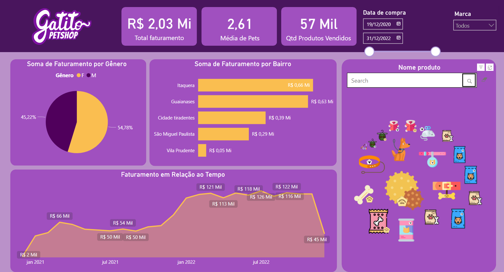
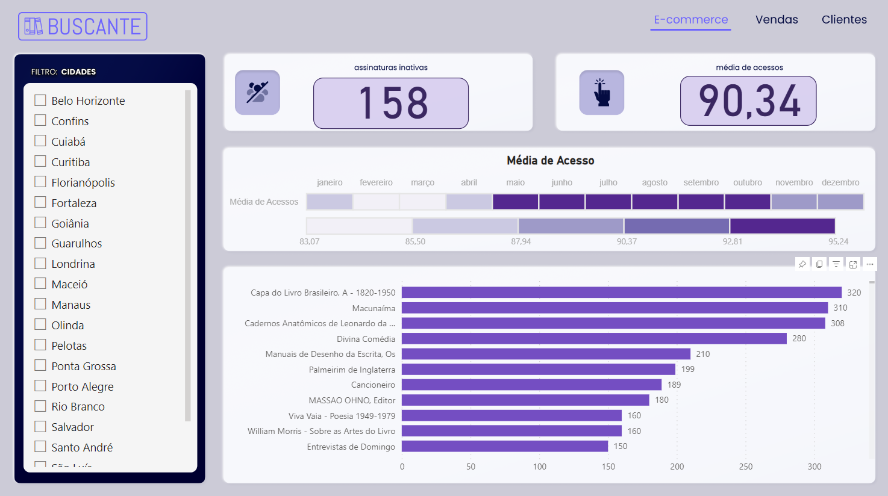

# Power Bi Projects

This repository houses the source code and documentation for our interactive and insightful Power BI dashboards. Leverage the power of data visualization to make informed decisions, analyze trends, and drive business success.

## Project 1
Objectives:
- Connect to: TXT file (CSV), Online spreadsheet (Google Sheets), Excel, and Folders
- Relate tables;
- Remove empty spaces;
- Introduction to DAX language;
- Add columns;
- Create measures and cards;
- Create pie, line, and bar charts (Identify which visuals best suit the data);
- Style visuals by Inserting  background and Importing new visuals.
- Configure mobile layout;
- Publish on the web;

[Link para o Dashboard Power BI](https://app.powerbi.com/view?r=eyJrIjoiOGM0MDVjN2MtZmY1Mi00NDZhLWFiYjctMmRjZGZlOTlhYTQyIiwidCI6IjQzMDcxOGMwLWYxODQtNDUwNS04ZThhLTkzMzRmMzdjN2UxOCJ9)

## Project 2
Objectives:

- Identifying the optimal moment to use the card visual;
- Utilizing the versatility and possibilities of the card component;
  (Changing the function that summarizes data on the cards, applying filters, and formatting and customizing the cards).
- Choosing one of the best visuals for working with goals (indicators);
- Filling in the fields of the indicator visual and exploring its formatting;
- Building a filter with a sliding bar, dropdown list, and vertical list.
- Working with tables and matrices in Power BI;
- Importing an external visual into Power BI;
- Working with a heatmap (table heatmap).
- Identifying and working with time series using line charts;
- Using small multiples, trend lines, and forecasting.
- Working with column and bar charts;
- Recognizing the differences between stacked and clustered charts;
- Using map visuals;
- Formatting the data category of a column.
- Structuring the report by gathering all visuals and maintaining report harmonization;
- Replicating formatting between visuals using the formatting brush;
- Navigating between pages through a button.

[Link para o Dashboard Power BI](https://app.powerbi.com/view?r=eyJrIjoiMTA4NmI5ZDUtODdkMC00N2Y1LWFiMjQtYzBjMmZjMTA1N2Q4IiwidCI6IjQzMDcxOGMwLWYxODQtNDUwNS04ZThhLTkzMzRmMzdjN2UxOCJ9)

